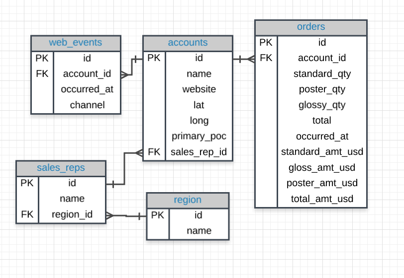

# PostgreSQL For Data Analysis - Udacity Course
## This repository contains all the practice SQL questions and the solution queries that are a part of this course

### The entire course uses a database called "Parch and Posey" which has info about a paper selling (imaginary)company.

